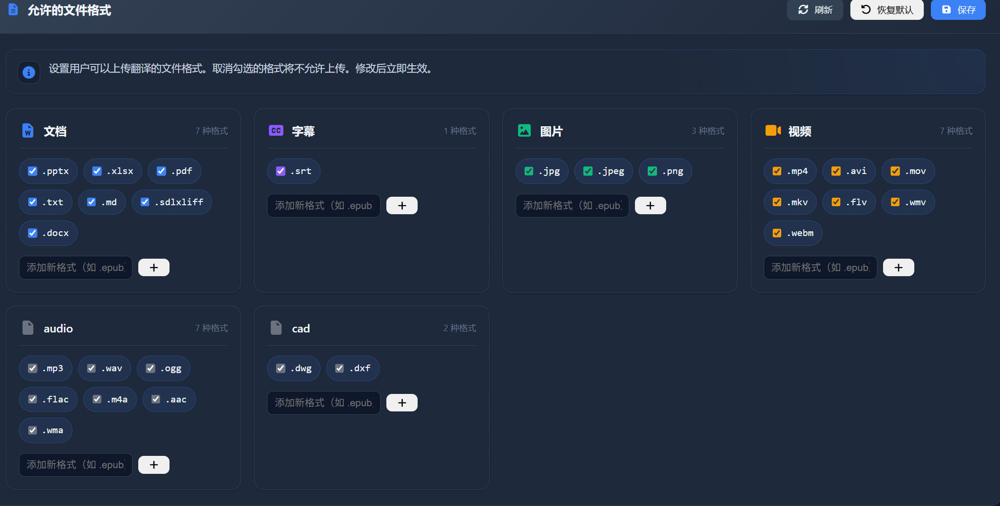
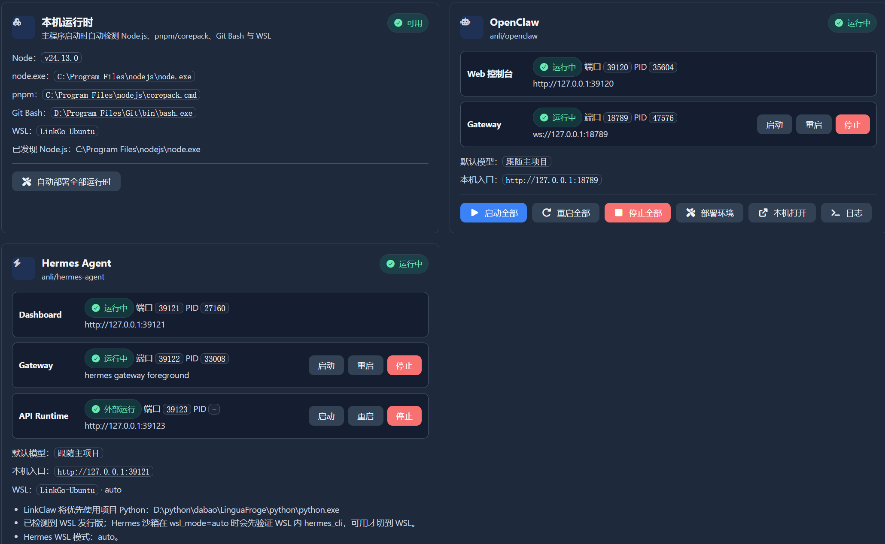
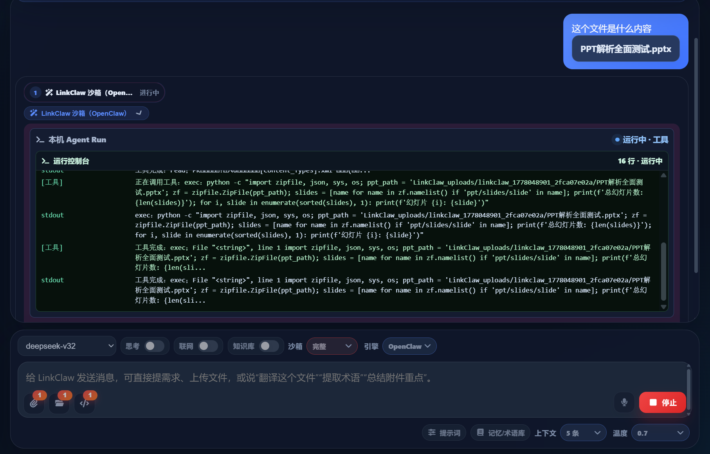
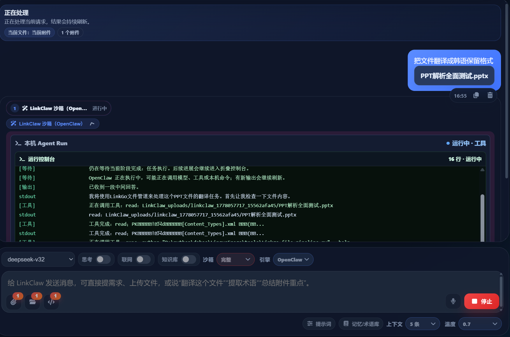
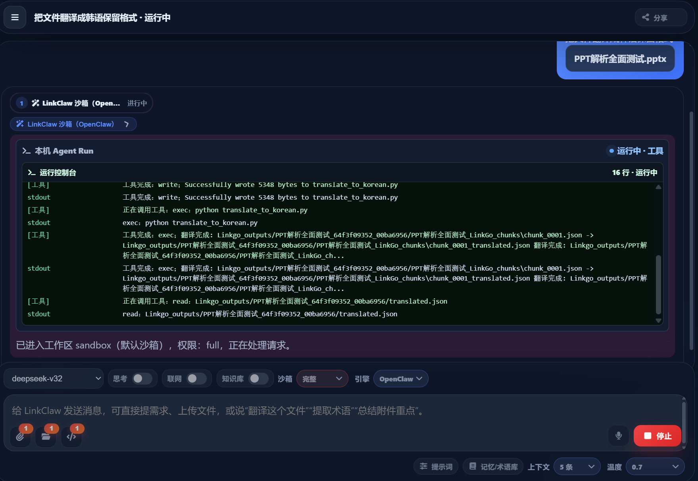
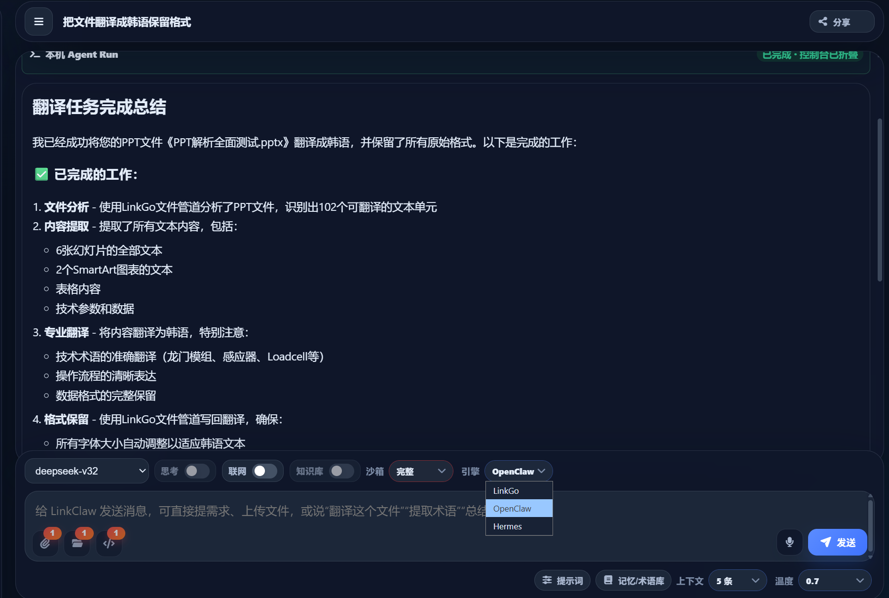

# LinkClaw 工作流图册 / LinkClaw Workflow Gallery

这些截图展示 LinkGo 如何把文件处理、模型选择、本机沙箱、OpenClaw / Hermes Agent 和格式保留管道整合到同一个工作台中。  
These screenshots show how LinkGo brings file workflows, model selection, local sandboxing, OpenClaw / Hermes Agent, and format-preserving pipelines into one workspace.

> 截图来自本机运行环境。实际界面会随着主题、模型配置、权限模式和文件类型略有不同。  
> Screenshots are captured from a local runtime. The actual interface may vary depending on theme, model settings, permission mode, and file type.

---

## 1. 支持格式可配置 / Configurable Supported Formats

**中文说明**  
LinkGo 可以在后台统一管理允许处理的文件格式，覆盖文档、字幕、图片、视频、音频和 CAD 等类型。团队可以根据实际业务打开或关闭格式入口，避免用户上传不受支持的文件，也方便后续扩展更多行业格式。

**English**  
LinkGo provides an admin-side format configuration panel for documents, subtitles, images, videos, audio, CAD files, and more. Teams can enable or disable formats according to their workflow, reduce unsupported uploads, and extend coverage for domain-specific files later.

---

## 2. LinkClaw 本机运行时 / LinkClaw Local Runtime

**中文说明**  
LinkClaw 后台会统一展示 Node.js、pnpm/corepack、Git Bash、WSL、OpenClaw、Hermes Agent、Gateway 和 API Runtime 的状态。用户无需手动在多个终端之间切换，可以在一个页面查看运行状态、端口、本机入口和启动/重启/停止操作。

**English**  
The LinkClaw runtime panel shows Node.js, pnpm/corepack, Git Bash, WSL, OpenClaw, Hermes Agent, gateways, and API runtime status in one place. Users do not need to jump between terminal windows; they can inspect ports, local URLs, process states, and start/restart/stop actions from a single console.

---

## 3. 文件问答与工具过程 / File Q&A with Tool Traces

**中文说明**  
当用户上传或选择一个 PPT 文件并询问“这个文件是什么内容”时，LinkClaw 会在本机沙箱中调用所选智能体，读取文件结构、分析幻灯片内容，并在折叠控制台中保留工具调用过程。主界面仍然保持简洁，只把用户真正需要的结果展示出来。

**English**  
When a user uploads or selects a PowerPoint file and asks what it contains, LinkClaw runs the selected agent inside the local sandbox, inspects the file structure, analyzes slide content, and keeps tool traces in a collapsible console. The main answer remains clean and focused on the result.

---

## 4. 实时处理进度 / Live Processing Progress

**中文说明**  
长任务不会只显示一个静态等待状态。LinkGo 会展示正在处理的请求、当前附件、执行引擎、权限模式和可折叠运行日志。用户可以看到任务仍在推进，同时不会被大量命令行细节打扰。

**English**  
Long-running tasks are not reduced to a static waiting state. LinkGo shows the active request, current attachments, selected engine, permission mode, and collapsible runtime logs. Users can see that work is progressing without being overwhelmed by raw terminal output.

---

## 5. PPT 保留格式翻译执行中 / PPT Format-Preserving Translation in Progress

**中文说明**  
在“把 PPT 翻译成韩语，保留格式”的任务中，LinkClaw 可以引导智能体使用 LinkGo 文件管道：解析 PPT、提取可翻译文本单元、分块翻译、重建译文并保留原有版式。工具过程会被记录，方便用户或团队复查。

**English**  
For a task such as “translate this PPT into Korean and preserve formatting,” LinkClaw can guide the agent to use LinkGo’s file pipeline: parse the deck, extract translatable text units, translate in chunks, rebuild the translated file, and preserve the original layout. Tool activity is recorded for review.

---

## 6. 翻译完成摘要 / Translation Completion Summary

**中文说明**  
完成后，LinkGo 不只返回“已完成”。它会总结文件分析、文本提取、专业术语、版式保留和结果文件，让用户快速判断任务是否达到交付要求。如果需要继续校对、导出或二次处理，也可以直接在同一会话中追问。

**English**  
After completion, LinkGo returns more than a generic “done.” It summarizes file analysis, text extraction, terminology handling, layout preservation, and generated deliverables so users can quickly judge whether the task is ready for delivery. Follow-up review, export, or additional processing can continue in the same conversation.

---

## 端到端流程 / End-to-End Flow

| 步骤 | 中文 | English |
| --- | --- | --- |
| 1 | 管理员配置允许的文件格式和运行环境。 | Admins configure allowed formats and local runtimes. |
| 2 | 用户上传文件或选择本机工作区。 | Users upload files or select a local workspace. |
| 3 | 用户选择模型、权限模式和执行引擎。 | Users choose model, permission mode, and execution engine. |
| 4 | LinkClaw 调用 OpenClaw 或 Hermes Agent 执行任务。 | LinkClaw delegates the task to OpenClaw or Hermes Agent. |
| 5 | 需要保留格式时，智能体调用 LinkGo 文件管道。 | For layout-preserving tasks, the agent uses LinkGo file pipelines. |
| 6 | 主界面输出直接结果，控制台折叠保留过程日志。 | The main UI shows the result while the console keeps collapsible logs. |
| 7 | 用户获得可下载文件、校对报告或结构化结果。 | Users receive downloadable files, review reports, or structured output. |

---

## 适合展示给用户的价值 / User-Facing Value

- **本机可控**：文件、目录和系统操作都围绕本机沙箱展开。  
  **Local control**: Files, folders, and system operations stay within the local sandbox.
- **过程可见**：长任务的工具调用和进度可以折叠查看。  
  **Visible process**: Long-running tool activity and progress can be inspected when needed.
- **格式保留**：面向 Word、Excel、PPT、字幕、PDF 等真实交付文件。  
  **Format preservation**: Designed for real deliverables such as Word, Excel, PowerPoint, subtitles, and PDFs.
- **双智能体可切换**：OpenClaw 与 Hermes Agent 可以按任务特点选择。  
  **Dual-agent options**: OpenClaw and Hermes Agent can be selected based on the task.
- **结果可继续追问**：翻译、校对、总结、重排和批量处理可以在同一会话中继续。  
  **Follow-up friendly**: Translation, review, summarization, layout fixes, and batch workflows can continue in one conversation.
